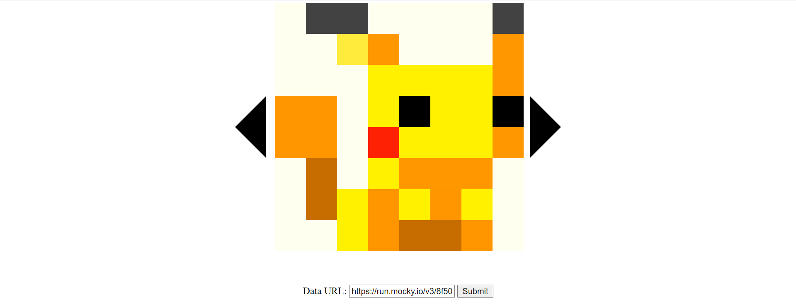
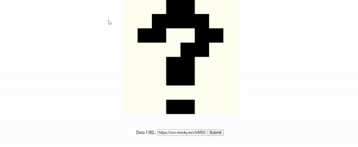

# Website Development Homework

## Instruction

1. Clone the repository
2. Modify index.html and add as many script/styles files as you need.
3. Enable Github Pages in the repository settings. (Use master branch and the root directory)

## Github Classroom Links

1. [2B01](https://classroom.github.com/a/P45pCpEX)
2. [2B02](https://classroom.github.com/a/MvV4ubF4)
3. [2B03](https://classroom.github.com/a/lmiUif1Y)
4. [2B04](https://classroom.github.com/a/g-XwrQqg)

## FED 1

By the end of this exercise, you should be able to use HTML/CSS to create a static website

### Tasks

Making use of HTML & CSS only. Replicate one of the following


> Pixel art 3: Pepe frog



> Pixel art 2: Pikachu


> Pixel art 1: Kirby

The key points are:

1. The Grid is 8 by 8 & Each cell is 50 by 50 pixel
2. The arrow button should change color (any) when the mouse hover over
3. All the elements should be centered horizontally no matter how I scale the page.

## FED 2

By the end of this exercise, you should be able to use JavaScript to handle DOM events and manipulate the DOM.

### Tasks

1. Make use of JavaScript and the following Array of Array to generate the Pixel Art instead. Your web page should load the first Pixel Art in the Array of Array at the start.
2. Clicking on the arrows should cycle the pixel art in both direction (i.e. 0 -> 1 -> 2 -> 0 -> 1 -> 2 -> ...).
3. The pixel art should have the following animation

    

```json
[
    [
        [0, 0, 0, 0, 0, 0, 0, 0],
        [0, "green", "green", 0, 0, "green", "green", 0],
        ["green", "green", "green", "green", "green", "green", "green", 0],
        ["green", "green", 0, "black", "green", 0, "black", 0],
        ["green", "green", "green", "green", "green", "green", "green", 0],
        ["blue", "green", "brown", "brown", "brown", "brown", "brown", 0],
        ["blue", "green", "green", "green", "green", "green", "green", 0],
        ["blue", "blue", "blue", "blue", "blue", "blue", "blue", 0]
    ],
    [
        [0, "#424242", "#424242", 0, 0, 0, 0, "#424242"],
        [0, 0, "#FFEB3B", "#FF9800", 0, 0, 0, "#FF9800"],
        [0, 0, 0, "#FFF100", "#FFF100", "#FFF100", "#FFF100", "#FF9800"],
        ["#FF9600", "#FF9600", 0, "#FFF100", "black", "#FFF100", "#FFF100", "black"],
        ["#FF9600", "#FF9600", 0, "#FF2104", "#FFF100", "#FFF100", "#FFF100", "#FF9800"],
        [0, "#C76D00", 0, "#FFF100", "#FF9800", "#FF9800", "#FF9800", 0],
        [0, "#C76D00", "#FFF100", "#FF9600", "#FFF100", "#FF9600", "#FFF100", 0],
        [0, 0, "#FFF100", "#FF9600", "#C76D00", "#C76D00", "#FF9600", 0]
    ],
    [
        ["#42A5F5", "#42A5F5", "#42A5F5", "#42A5F5", "#42A5F5", "#42A5F5", "#42A5F5", "#42A5F5"],
        ["#42A5F5", "#42A5F5", "#F8BBD0", "#F8BBD0", "#F8BBD0", "#F8BBD0", "#42A5F5", "#42A5F5"],
        ["#42A5F5", "#F8BBD0", "#F8BBD0", "#F8BBD0", "#F8BBD0", "#F8BBD0", "#F8BBD0", "#42A5F5"],
        ["#42A5F5", "#F48FB1", "#F8BBD0", "#000000", "#F8BBD0", "#000000", "#F8BBD0", "#42A5F5"],
        ["#F48FB1", "#F8BBD0", "#F8BBD0", "#1A237E", "#F8BBD0", "#1A237E", "#F8BBD0", "#42A5F5"],
        ["#F48FB1", "#F48FB1", "#F06292", "#F8BBD0", "#F8BBD0", "#F8BBD0", "#F06292", "#F48FB1"],
        ["#42A5F5", "#AD1457", "#F48FB1", "#F48FB1", "#F8BBD0", "#F8BBD0", "#AD1457", "#42A5F5"],
        ["#4CA649", "#AD1457", "#C2185B", "#C2185B", "#4CA649", "#AD1457", "#C2185B", "#4CA649"]
    ]
]
```

The key points are:

1. The images are loaded by JavaScript
2. The arrow button cycles the images
3. The transition is animated

## FED 3

By the end of this exercise, you should be able to use JavaScript to send HTTP request and manipulate the DOM based on the HTTP response.

### Tasks

1. Update your code such that when the page first load, the grid should show a question mark with the input fields below. The question mark should appear with animation (See full demo below).
   
2. On page load, the arrows should be hidden (They will be expected to appear later)
3. When the user clicks "Submit", send a GET request to whatever the value is in the input field. (You can use this url: https://run.mocky.io/v3/8f504e33-bf83-43fb-8608-3129dbb1e5f5)
4. You should add a loading animation and hide the input field while waiting for the request
   
5. Once the request have successfully responded, display the arrow to allow the users to cycle the pixel art once again.
6. Use the body of the response to generate the pixel art.
7. New request should restart from the first pixel art.

## Full Demo

The following is the full demo of the entire application


The key points are

1. On page load, the question mark appears with animation.
2. On page load, the buttons should be hidden
3. On submit button click, send a http GET request to that url.
4. While waiting for the response, show a loading animation
5. When the response is received show the input field and the arrow buttons.
6. Using the body of the HTTP response, generate the pixel arts.
7. Making new request should restart the cycling from the first pixel art.
